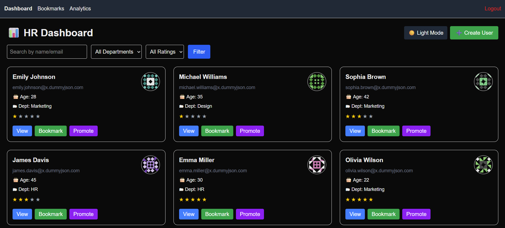
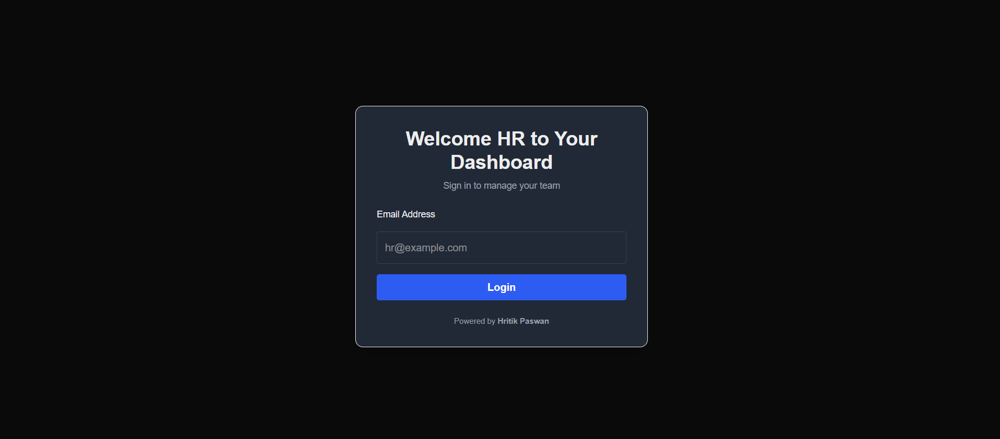
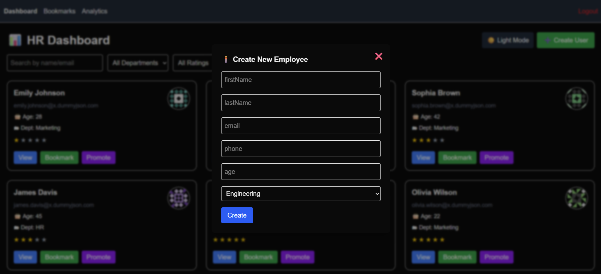
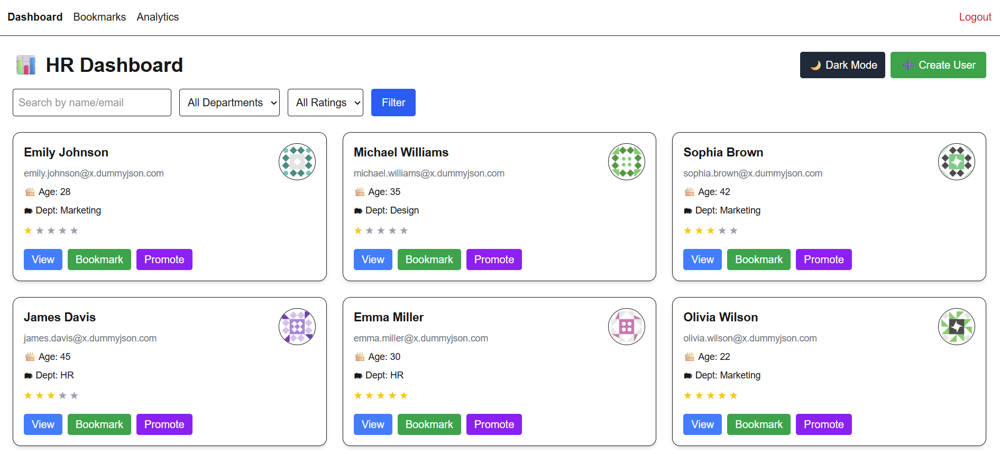
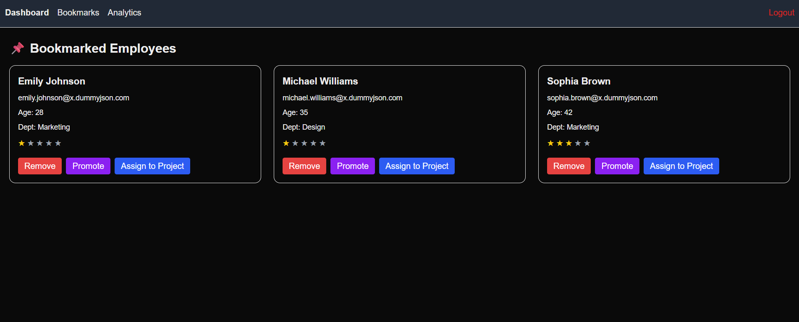
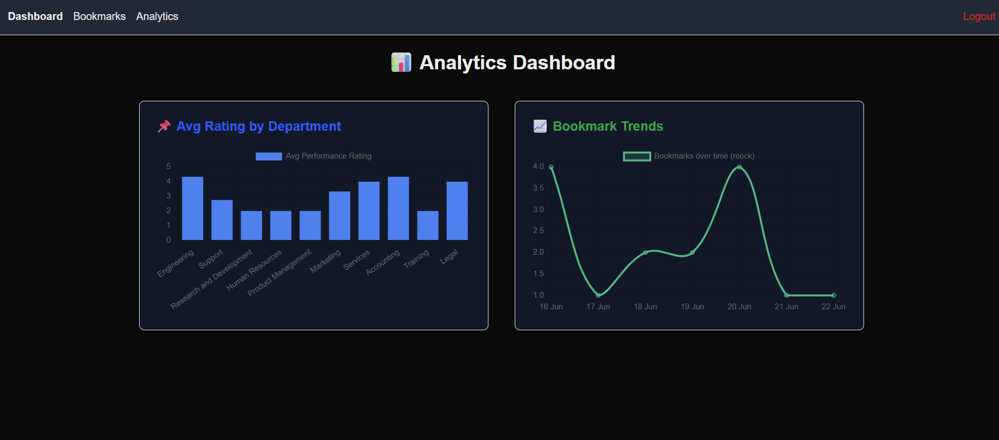

This is a [Next.js](https://nextjs.org) project bootstrapped with [`create-next-app`](https://github.com/vercel/next.js/tree/canary/packages/create-next-app).

## Getting Started

# 📊 HR Dashboard

An interactive and responsive HR Dashboard built using **Next.js 15**, **Tailwind CSS**, and **Context API**, designed to manage and visualize employee data efficiently.

## 🚀 Features

- 🧑‍💼 View Employee Profiles (with dynamic performance ratings)
- 🔍 Search & Filter by Name, Department, Rating
- ⭐ Bookmark Employees
- 📈 Analytics Page (for performance insights)
- 🌗 Light/Dark Theme Toggle (Theme saved in LocalStorage)
- 🔒 Login (Mock authentication using email + localStorage)
- 🎯 Promote Employees (Toast message feedback)
- ➕ Add New Employee (via modal with form validation)
- 🔄 Pagination Support
- ✅ Protected Routes (Dashboard, Bookmarks, Analytics)

---

## 🧩 Tech Stack

- [Next.js 15 App Router](https://nextjs.org/docs)
- [Tailwind CSS](https://tailwindcss.com/)
- [Context API](https://reactjs.org/docs/context.html)
- [Zustand](https://github.com/pmndrs/zustand) (for bookmark state)
- [React Hot Toast](https://react-hot-toast.com/) (notifications)

---

## ⚙️ Setup Instructions

### 1. Clone the Repository

```bash
git clone https://github.com/Hritik1753/hr-dashboard.git
cd hr-dashboard


First, run the development server:

```bash
npm run dev
# or
yarn dev
# or
pnpm dev
# or
bun dev
```

🌐 Deployment
Deployed on Vercel:

🔗 Live URL:(https://hr-dashboard-g2d9.vercel.app/login )

📸 Screenshots


🖥 Dashboard View


### 🔐 Login Page


🔎 createuser


🌓 Light/Dark Mode


bookmarks


analytics


Add your actual screenshots in the /public/screenshots folder or any path you prefer.

👨‍💻 Author
Hritik Paswan
LinkedIn • GitHub

📄 License
This project is licensed under the MIT License.

yaml
Copy
Edit

---

### ✅ To Use This:

1. Save it as `README.md` in the root of your project.
2. Take some screenshots of your app (`Dashboard`, `Search`, `Dark Mode`) and save them in `/public/screenshots/` folder or wherever you like. Just update the image paths accordingly.

Would you like help generating mock screenshots if you haven’t taken any yet?


Open [http://localhost:3000](http://localhost:3000) with your browser to see the result.

You can start editing the page by modifying `app/page.js`. The page auto-updates as you edit the file.

This project uses [`next/font`](https://nextjs.org/docs/app/building-your-application/optimizing/fonts) to automatically optimize and load [Geist](https://vercel.com/font), a new font family for Vercel.

## Learn More

To learn more about Next.js, take a look at the following resources:

- [Next.js Documentation](https://nextjs.org/docs) - learn about Next.js features and API.
- [Learn Next.js](https://nextjs.org/learn) - an interactive Next.js tutorial.

You can check out [the Next.js GitHub repository](https://github.com/vercel/next.js) - your feedback and contributions are welcome!

## Deploy on Vercel

The easiest way to deploy your Next.js app is to use the [Vercel Platform](https://vercel.com/new?utm_medium=default-template&filter=next.js&utm_source=create-next-app&utm_campaign=create-next-app-readme) from the creators of Next.js.

Check out our [Next.js deployment documentation](https://nextjs.org/docs/app/building-your-application/deploying) for more details.
